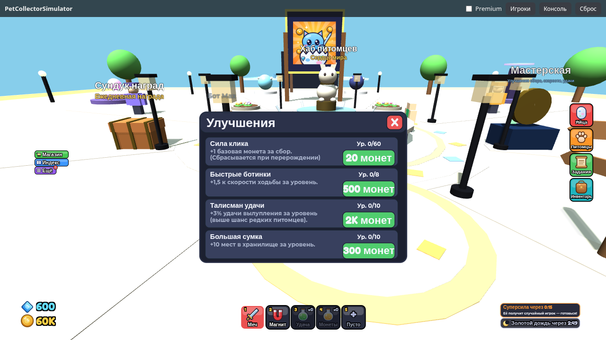
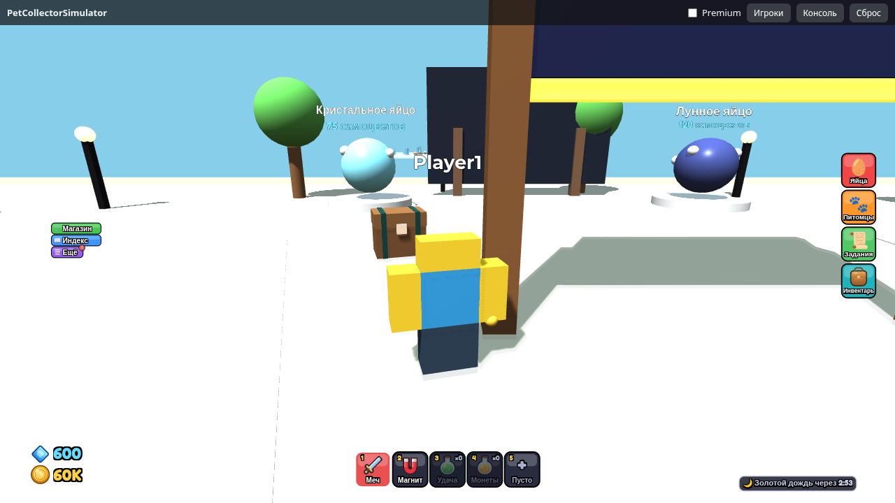
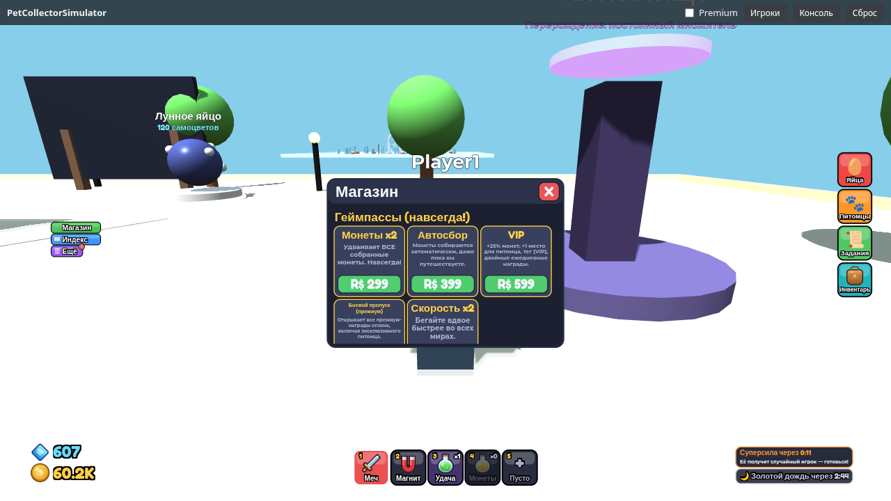
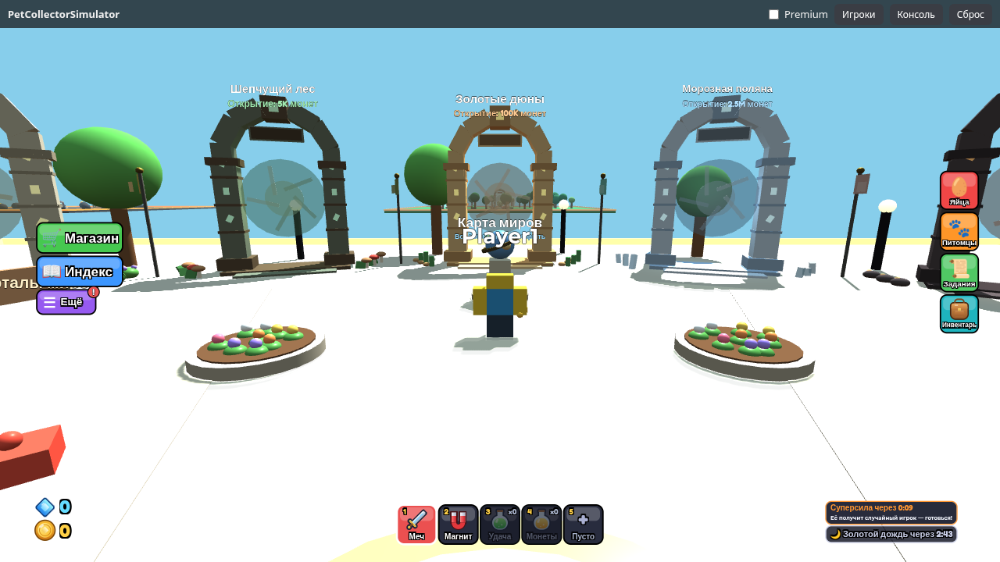
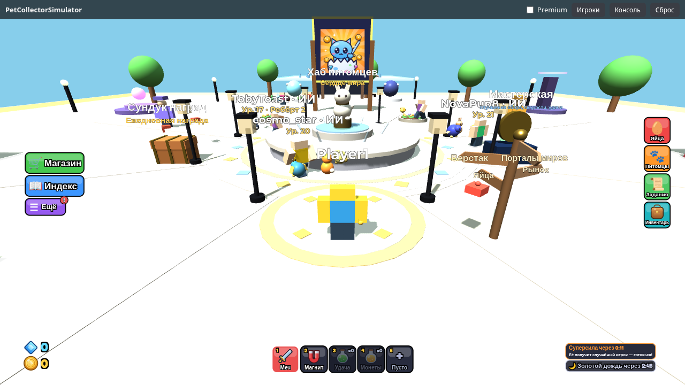
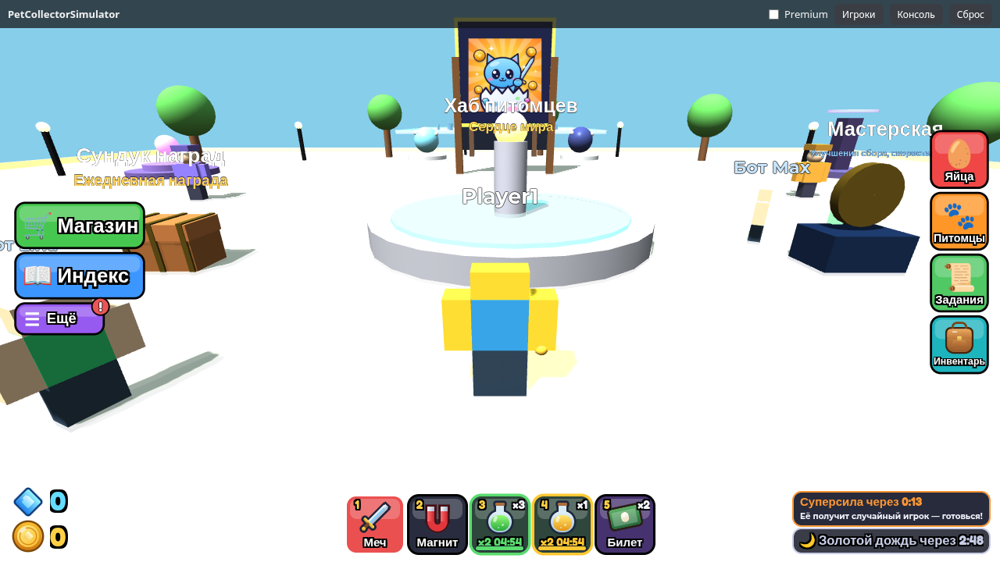
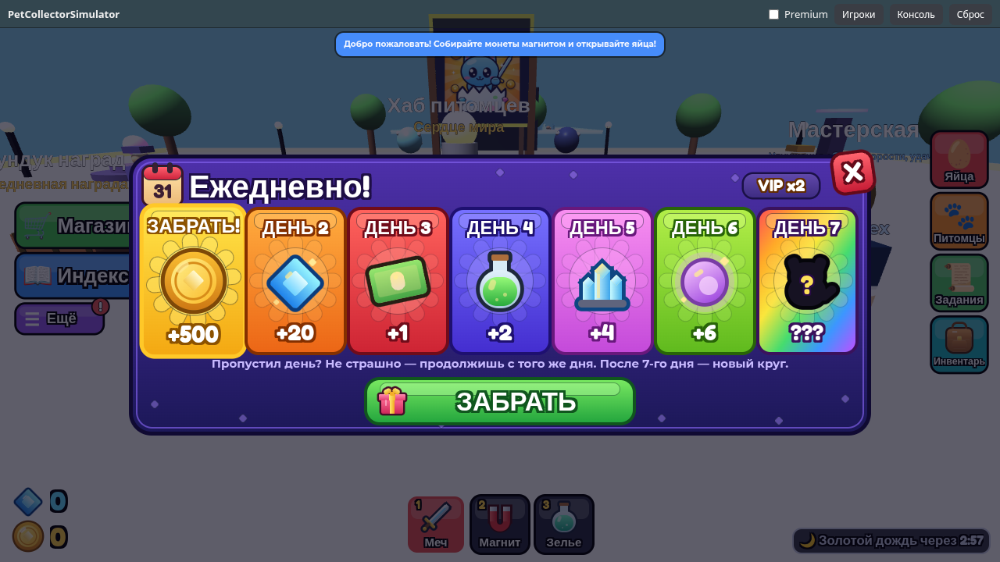

# Pet Collector Simulator v3.2.2 — веб-демо на реальном Luau-коде

▶ **Играть: https://joliks.github.io/pet-collector-sim/**

Это **не переписанная на JS копия**: страница запускает **исходные Luau-скрипты игры** из [`roblox-source/`](roblox-source/) —
их переводит в JavaScript транспилятор [roblox2web](https://github.com/JoLiKs/roblox2web) (<https://joliks.github.io/roblox2web/>),
а `Workspace`, `Players`, `RemoteEvent`, `DataStore`, GUI, 3D (three.js) эмулирует его же рантайм. Серверные скрипты, клиентский интерфейс и общие модули выполняются в одной вкладке.

## Скачать
* [`PetCollectorSimulator_v3.2.zip`](PetCollectorSimulator_v3.2.zip) — проект целиком (src, документация, тесты, `.rbxlx`, `.rbxl`)
* [`PetCollectorSimulator.rbxl`](PetCollectorSimulator.rbxl) / [`PetCollectorSimulator.rbxlx`](PetCollectorSimulator.rbxlx) — готовое место для Roblox Studio (бинарный / XML)
* [`PetCollectorSimulator_web.zip`](PetCollectorSimulator_web.zip) — эта веб-версия для самостоятельного хостинга
* Скриншоты: [`roblox-source/docs/screens/`](roblox-source/docs/screens/), документация: [`roblox-source/docs/`](roblox-source/docs/)

## Язык
Игра на **русском или английском**: страна определяется по IP (Cloudflare `cdn-cgi/trace` → geojs.io → country.is → ipapi.co, до ~2 с), при неудаче — по языку браузера. RU/BY/KZ/KG/AM/AZ/MD/TJ/UZ/TM → русский; Украина → русский только при русском языке браузера. Переключатель — **Ещё → Настройки / More → Settings**.

## Новое в v3.2.2
* **Звук:** музыка не пропадает, если трек долго грузится (повтор загрузки), строка «Музыка: играет / загружается / ошибка» в настройках; «Звуки: выкл» выключает и шаги персонажей (группы звука Music/SFX). В веб-демо звука нет — эмулятор не воспроизводит аудио.

## Новое в v3.2 / v3.2.1
* **Подписи мира** — размер в пикселях, без наложений, не закрывают HUD; названия миров и яиц больше не огромные.
* **Текст в окнах не мельче 12 px** (заголовки 14 px), без обрезки; v3.2.1 — описания в «Улучшениях», магазине, талантах и «Мирах» одного размера с переносом.
* **Телефон:** окна в безопасной области с прокруткой, крестик виден, VIP и Боевой пропуск доступны.
* **Значки из примитивов** вместо эмодзи; **«Авто»** — только у владельцев пропуска, в листе «Ещё».
* **Морской сундук** — проверка места появления; **боты** уступают врагов игрокам и ограничены по числу; звук — запасной путь при недоступном ассете.
* **Аудит:** покупки (ProcessReceipt) без повторной выдачи, подписи/подписки без дублей — см. [`docs/AUDIT_v3.2.md`](roblox-source/docs/AUDIT_v3.2.md).

## Новое в v3.1
* **Быстрые слоты:** исправлено назначение предмета в пустой слот в настоящей игре; из пустого «+» предмет теперь кладётся одним тапом.
* **Морские сундуки:** раз в 5 минут в случайном месте хаба появляется сундук — о нём говорит только тихий звук. Нажмите E или просто коснитесь его: первый открывший получает монеты, гемы, зелье, ресурсы и билет на яйцо (иногда — бонус). В демо сундук собран из деталей (модель `.rbxm` есть в Roblox-версии).
* **Музыка:** спокойная тема и эпичная во время «Суперсилы» с плавным переходом; «Настройки» → музыка вкл/выкл, громкость, звуки вкл/выкл. В веб-демо звука нет (эмулятор не воспроизводит аудио), настройки работают и сохраняются.
* **«Суперсила» в 2 раза реже**, **кнопки слева в 2.5 раза ниже**, **окна в 1.5 раза меньше**.

## Новое в v3.0
* **ИИ-боты:** на сервере, где меньше 5 игроков, гуляют 10–20 ботов с меткой «ИИ» — собирают ресурсы, бьют мобов, открывают яйца, ходят по мирам и участвуют в «Суперсиле». Это не игроки: их нет в списке игроков и рейтингах, они не пишут в чат, ничего не покупают и не торгуют. В демо — R6-фигурки (в Roblox — R15). Отключить: `?attr.BotsDisabled=true`.
* **Порталы миров** — каменные рунные арки со спокойным вихрем и табличкой «название мира + требование». Подойдите и нажмите E: открытый мир — переход, закрытый — окно «Миры».
* **Площадь спавна:** узор, фонтан со статуей питомца, клумбы, фонари, флаги и указатель к порталам, верстаку, рынку и яйцам.
* **Зелья «Лечение» (+70% здоровья сразу) и «Реген» (×3 восстановление на 5 с)** — кладутся в быстрые слоты, крафтятся на верстаке и выпадают с врагов.
* **Интерфейс в 1.5 раза компактнее** (на телефоне — чуть крупнее, чтобы кнопки оставались удобными).

## Новое в v2.9
* **Быстрые слоты 3, 4, 5** в хотбаре: в «Инвентаре» нажмите на предмет — «В слот 3 / 4 / 5». Зелье удачи и эликсир монет выпиваются тапом, на слоте виден таймер буста и убывающая полоса; билет открывает яйцо, если вы рядом с ним. Пустой слот «+» открывает инвентарь.

## Новое в v2.8
* **Ежедневная награда за вход** — окно «Ежедневно!» с 7 карточками открывается само при первом входе за сутки (после экрана загрузки). Награды — предметы игры: монеты, гемы, билет на яйцо, зелья удачи, кристаллы, эссенция, на 7-й день — питомец Epic; VIP ×2. Пропуск дня не сбрасывает прогресс. После получения окно само не появится до следующих суток (даже после перезагрузки страницы — сохранение в браузере); открыть вручную — «Ещё → Награды дня».

## Новое в v2.7
* **Настоящие покупки в Roblox:** 5 геймпассов и 9 продуктов созданы в опыте и выставлены на продажу, у каждого своя иконка. Магазин показывает их реальные цены; в этой веб-версии покупка проходит через демо-окно — **деньги не списываются**.
* Пасс начинает действовать сразу после покупки; в магазине появилась группа «Эссенция и боевой пропуск» — продаются все 9 продуктов.

## Новое в v2.6
* **Иконка игры и логотип**: экран загрузки с логотипом и табличка с ним в хабе (в демо — настоящая картинка `assets/icon_512.png` через сопоставление ассетов roblox2web 2.4), значок «Добро пожаловать» (в Roblox — через BadgeService).
* **Вернулся замах мечом** — рука и меч заметно двигаются при ударе в воздух, по врагу и по суперигроку.
* **Кнопка «Инвентарь»** (справа, сумка): дерево, камень, руда, травы, кристаллы, эссенция, осколки и предметы — у каждого своя иконка; нажмите на ячейку — описание, где добыть и для чего нужен.
* **Иконки монет и самоцветов** нарисованы примитивами (эмодзи 🪙 не отображался на Windows 10 и в части шрифтов).

## Новое в v2.5
HUD как в Roblox-симуляторах (Магазин/Индекс/Ещё слева, Яйца/Питомцы/Задания справа, валюты слева снизу, хотбар из 3 настоящих инструментов), Индекс питомцев, новая отрисовка врагов и боссов.

## Новое в v2.4
Исправления по аудиту v2.3: интерфейс для телефонов (портрет и ландшафт, кнопка «УДАР» в зоне большого пальца), обучение первой сессии (5 шагов с наградой), почта питомцев при полной сумке, шансы слияния с катализатором, анти-AFK для «Суперсилы», награда за убийство по доле урона, пересмотр ребёртов. Демо-бот Trader Tom и боты «Суперсилы» включены только в этой веб-версии (патчем `roblox2web.config.json`), в живой игре они выключены.

## Суперсила / Охота (с v2.3)
Каждую минуту кто-то получает **суперсилу** (вырастает, светится, быстрее бегает, бьёт ударной волной), остальные получают задание **«Останови …!»** — карточка справа вверху, стрелка на экране и стрелка-компас под ногами. Бейте суперигрока мечом (слот 1 хотбара + клик/тап по миру, или **Q**), пока его HP не кончится, — награда по вкладу. Если суперсила досталась вам — продержитесь до конца таймера и отбивайтесь ударной волной.
В демо игрок один, поэтому по хабу бегают **3 бота-игрока** (Max, Lina, Rex): они охотятся вместе с вами и иногда сами становятся суперигроками. Первый раунд — через ~25 с после загрузки; ускорить цикл: `?attr.SuperpowerTimeScale=6`.

## Управление
* **WASD / стрелки** — ходьба, **ЛКМ-перетаскивание** — камера, **Пробел** — прыжок
* **E** — действие рядом с объектом (яйца, NPC, верстак, рынок, ресурсы, сундуки)
* Хотбар внизу: **1 — Меч** (клик/тап по миру или **Q** — удар), **2 — Магнит** (клик/тап или **F** — сбор монет), **3–5 — быстрые слоты предметов** (по умолчанию зелье удачи и эликсир монет; выбор — в «Инвентаре»); слева — Магазин, Индекс, Ещё; справа — Яйца, Питомцы, Задания, Инвентарь
* Окно «Ещё»: Улучшения · Ребёрт · Таланты · Награды дня · Миры · Крафт · Рынок · Обмен · Топ · Настройки

## Что внутри игры (всё — Luau)
Хаб с NPC и станциями + 5 биомов, добыча ресурсов и сундуки с респавном, враги и боссы с ИИ, автоатака питомцев и ручной удар, события (Золотой дождь, Лунная ночь, рейд-босс Stone Colossus),
39 питомцев (4 стихии, 3 роли, 6 редкостей, варианты Golden/Rainbow/Shiny), уровни и эволюция, слияние 3→1, команда, избранное и фильтры, крафт, квесты с диалогами NPC и ежедневные, достижения, ребёрт с деревом талантов, торговля (в демо — с ботом Tom), ротация магазина, батл-пасс, оффлайн-доход, лидерборды, монетизация (геймпассы/продукты: в демо — диалог «купить» без реальных платежей).

## Параметры URL
`?country=RU` / `?country=US` — страна (язык игры по стране) · `?lang=en` / `?lang=ru` — язык браузера (без гео-запроса) · `?persist=0` — не сохранять прогресс · `?premium=1` — Premium-игрок · `?seed=N` — зерно случайности · `?touch=1` — тач-режим · `?autobuy=1` — демо-покупки без диалога · `?quiet=1` — меньше логов · `?attr.SuperpowerTimeScale=6` — «Суперсила» в 6 раз чаще (атрибут `Workspace`).
Кнопка «Сброс» в шапке стирает сохранение (localStorage). Время в эмуляторе виртуальное (идёт по кадрам), поэтому на слабом компьютере события и таймеры идут медленнее.

## Ограничения демо
Один локальный игрок (торговец Tom, «друг» и охотники «Суперсилы» — серверные боты), нет настоящей сети/DataStore/платежей, MeshPart рисуются коробками, нет звука и анимаций, частицы — неоновыми деталями, SurfaceGui (табло лидеров) не отображается. Подробности — в [README](roblox-source/README.md) проекта.
