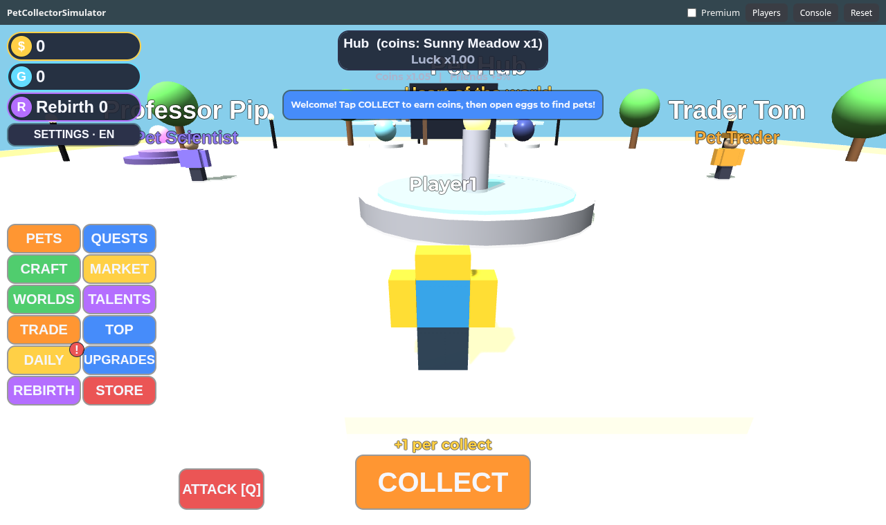
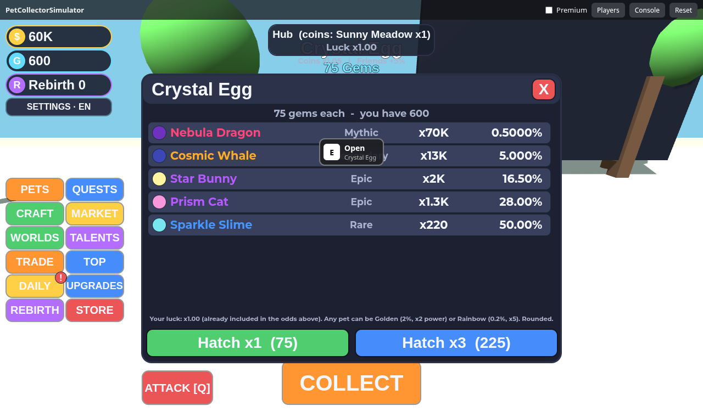

# Pet Collector Simulator v2.2 — 3D-симулятор питомцев для Roblox (Luau)

Игра в жанре **pet simulator + мини-RPG**: хаб с NPC и станциями, пять биомов-миров, добыча ресурсов, враги и боссы, автоатака питомцев, события по расписанию,
питомцы с **редкостями, стихиями, ролями, уровнями, эволюцией, слиянием 3→1 (Golden/Rainbow/Shiny)**, команда, крафт, квесты с диалогами, достижения, ребёрт с **деревом талантов**,
**торговля** (в демо — с ботом), **ротация магазина**, **батл-пасс** (free/premium), оффлайн-доход, лидерборды и полноценная монетизация.
Всё — код на **Luau**, ни одного внешнего ассета: мир, интерфейс и питомцы строятся скриптами из примитивов.
**Два языка — русский и английский**: язык выбирается автоматически по стране игрока (и языку клиента), переключается в настройках и сохраняется в данных игрока (см. [§ Языки](#языки)).

▶ **Веб-демо (реальный Luau-код → JS через [roblox2web](https://github.com/JoLiKs/roblox2web)):** <https://joliks.github.io/pet-collector-sim/>
Сам конвертор: <https://joliks.github.io/roblox2web/>

> ⚠️ **Прочитайте сразу.** Проект проверен линтерами, типовым анализом, тестами логики (1189 проверок), интеграционным сценарием (104 проверки) и браузерными UI-тестами (81 проверка) **в эмуляторе Roblox**,
> но **не запускался в настоящей Roblox Studio** (в среде сборки её нет). Список проверенного и непроверенного — [`docs/TESTING.md`](docs/TESTING.md);
> честная оценка рисков и урезанного — [`docs/HONEST_ASSESSMENT.md`](docs/HONEST_ASSESSMENT.md). **Никакого дохода проект не гарантирует.**

---

## Скриншоты (настоящая игра в веб-версии, Chromium)

| | |
|---|---|
|  Хаб, HUD и меню |  Яйцо хаба |
|  Инвентарь питомцев |  Слияние 3→1 |
|  Крафт |  NPC и квесты |
|  Магазин с ротацией |  Батл-пасс |
|  Таланты |  Торговля с ботом |
|  Зоны-биомы |  Враги и сбор ресурсов |
|  Событие: рейд-босс |  Онлайн-конвертор roblox2web |
|  Удар мечом: замах, дуга, рывок |  Русский интерфейс (страна RU) |
|  Питомцы на русском |  Таланты на русском |

Скриншоты создают `tests/browser/test_game_ui.py`, `test_swing.py` и `test_locale.py` (см. `docs/TESTING.md`). Эмулятор рисует меши боксами, а табло — заглушками, в Studio картинка будет богаче.

## 1. Геймплей (кратко; подробно — [`docs/MECHANICS.md`](docs/MECHANICS.md))

| Система | Суть |
|---|---|
| **Мир** | Хаб (фонтан, NPC Mira/Bruno/Pip/Tom, верстак, рынок, алтарь ребёрта, портал, яйца, табло) + 5 биомов на расстоянии ~520 студов: Meadow, Forest, Desert, Frost, Volcano. Телепорт через портал/панель WORLDS, площадки «Return to Hub». |
| **Ресурсы** | Дерево, камень, руда, трава, кристаллы (+эссенция с врагов). Узлы и сундуки собираются удержанием `E`, респавнятся. |
| **Бой** | Враги бродят по биомам и атакуют игрока; питомцы бьют сами раз в секунду (урон = сила × роль × стихия), игрок помогает ударом `ATTACK`/`Q`. Боссы зон с полосой здоровья и наградой. |
| **События** | По расписанию (`EventData`): **Golden Rain** (золотые монеты на хабе, x2 монеты), **Lunar Night** (редкие «лунные» питомцы + Lunar Egg), **Stone Colossus** (рейд-босс с таймером и общей наградой по доле урона). |
| **Питомцы** | 39 видов; 6 редкостей; стихии Fire/Water/Earth/Air (круг слабостей); роли Fighter/Collector/Support; активные и пассивные способности; уровни/опыт; 3 эволюции; варианты Normal/Golden/Rainbow/Shiny. |
| **Слияние** | 3 одинаковых (вид+вариант) → 1, шанс повысить вариант (+катализатор), шанс сразу Shiny. |
| **Команда и инвентарь** | До 3+ слотов (апгрейд, VIP, талант; потолок 8), «Equip Best», избранное, фильтры по стихии/роли/редкости, сортировка. |
| **Крафт** | Верстак в хабе: билеты на яйца, зелья, катализатор, инструменты и оружие. |
| **Квесты** | 3 NPC × цепочки по 3 шага с диалогами, 3 ежедневных задания (меняются каждый UTC-день), 22 достижения. |
| **Ребёрт и таланты** | Сброс монет/Click Power → множитель монет, гемы, очки талантов; дерево из 3 веток (Economy/Combat/Nature). |
| **Торговля** | Окно обмена: питомцы + монеты, обе стороны жмут Ready и Confirm после отсчёта; серверная валидация. В демо партнёр — бот Trader Tom. |
| **Магазин и батл-пасс** | Лавка с ротацией каждые 10 мин (6 из 14 предложений, лимит запасов); батл-пасс 30 уровней, free/premium треки. |
| **Ретеншн** | Ежедневная серия, оффлайн-доход (до 8 ч), друзья на сервере (+5% монет за друга), лидерборды (сервер + глобальный). |
| **Языки** | Русский / английский: весь интерфейс, сообщения, данные, NPC, таблички в мире. Авто по стране (`LocalizationService`), ручной выбор в НАСТРОЙКАХ. |

## 2. Монетизация (всё настраивается в одном файле)

Файл: **`src/ReplicatedStorage/Config.lua`** (в Studio: `ReplicatedStorage → Shared → Config`). Там же комментарии «как получить ID».

| Тип | Ключ | Что даёт | Реком. цена* |
|---|---|---|---|
| Геймпасс | `DOUBLE_COINS` | ×2 ко всем монетам | 299 R$ |
| Геймпасс | `DOUBLE_SPEED` | ×2 скорость бега | 149 R$ |
| Геймпасс | `AUTO_COLLECT` | автосбор (2 клика/сек на сервере, переключатель AUTO) | 399 R$ |
| Геймпасс | `VIP` | +25% монет, +1 слот питомца, тег `[VIP]`, ×2 ежедневные награды, +10% удачи | 599 R$ |
| Геймпасс | `BATTLE_PASS` | премиум-трек батл-пасса сезона (в т. ч. питомец Season Owl) | 499 R$ |
| Продукт | `GEMS_SMALL / MEDIUM / LARGE` | 100 / 550 / 1500 гемов | 79 / 349 / 899 R$ |
| Продукт | `COINS_SMALL / LARGE` | монеты, масштабируемые под прогресс игрока | 79 / 399 R$ |
| Продукт | `LUCK_2X_15M`, `LUCK_5X_10M` | лаки-буст ×2 на 15 мин, ×5 на 10 мин (суммируются по времени) | 79 / 199 R$ |
| Продукт | `BP_SKIP` | +5 уровней батл-пасса | 129 R$ |
| Продукт | `ESSENCE_PACK` | 30 эссенции для эволюции питомцев | 99 R$ |
| Premium | автоматически | +10% монет и +5 гемов к ежедневной награде для подписчиков Roblox Premium | — |

\*Цены — только ориентир; реальную цену вы задаёте в Creator Hub. ID по умолчанию `0` = «не настроено» (кнопка покажет подсказку, ошибок нет).
В **веб-демо** ненулевые тестовые ID подставляются «патчами» конвертора из `roblox2web.config.json` — исходники игры при этом не меняются.

**Правильный `ProcessReceipt`:** один обработчик; идемпотентность через `PurchaseId`, записанный в данные игрока вместе с наградой;
`PurchaseGranted` возвращается **только после успешного сохранения**; любая неопределённость → `NotProcessedYet`.

**Платные случайные предметы:** шансы показываются численно до покупки, удача отображается и меняет шансы, используется
`PolicyService.ArePaidRandomItemsRestricted` (для ограниченных игроков пакеты гемов/монет/лаки-бусты скрыты, платная удача не действует).

## 3. Что в архиве

```
roblox-game/
├── PetCollectorSimulator.rbxlx      ← готовый place-файл: открыть в Studio двойным кликом, Rojo не нужен
├── default.project.json             ← Rojo-проект
├── roblox2web.config.json           ← настройки веб-демо (демо-ID пассов/продуктов патчами, каталог покупок)
├── src/
│   ├── ReplicatedStorage/           ← общие данные и чистая логика: Config, PetData, PetMeta, Abilities, ZoneData, EnemyData, ResourceData,
│   │                                   RecipeData, QuestData, AchievementData, TalentData, BattlePassData, ShopData, EventData,
│   │                                   TradeLogic, Formulas, UpgradeData, PetModel, AttackFx, Remotes, Util,
│   │                                   Locale + LocaleEn + LocaleRu (строки интерфейса и перевод данных)
│   ├── ServerScriptService/Server/  ← сервисы: Data, Economy, State, Router, AntiExploit, Pet, Click, Upgrade, Zone, Rebirth, Daily, Monetization,
│   │                                   Leaderboard, Player, WorldBuilder, Resource, Combat, Event, Craft, Quest, Station, Shop, BattlePass, Trade,
│   │                                   Offline, Progress, Dailies, Migrations, LanguageService …
│   ├── StarterPlayer/StarterPlayerScripts/  ← PetFollower (питомцы за игроками), CombatFx (эффекты удара), WorldLocalizer (перевод текстов мира)
│   └── StarterGui/PetCollectorGui/  ← ScreenGui + UIController + Modules/ (HUD, Fx, панели Pets/Quests/Craft/Market/Talents/Trade/Boards/…)
├── tools/                           ← build_rbxlx.py, validate_rbxlx.py, check_all.sh, check_strings.py (линтер строк), publish_web.sh
├── tests/                           ← cases.lua (логика), game/ (интеграция в эмуляторе), browser/ (Chromium: UI, удар, локализация)
├── docs/                            ← документация и screens/ (скриншоты)
├── dist/PetCollectorSimulator_v2.2.zip, PetCollectorSimulator_v2.2.zip
└── stylua.toml, selene.toml, rokit.toml
```

## 4. Быстрый старт (без Rojo) — пошагово

### Шаг 1. Установите Roblox Studio
1. Зайдите на <https://create.roblox.com> (или roblox.com → **Create**), войдите в аккаунт (создайте, если нет).
2. Нажмите **Download Studio** / **Start Creating**, установите и войдите в Studio тем же аккаунтом.

### Шаг 2. Откройте готовый файл
1. Распакуйте zip.
2. Studio → **File → Open from File…** → выберите `PetCollectorSimulator.rbxlx`.
3. В Explorer должны быть: `ReplicatedStorage/Shared/…`, `ServerScriptService/Main` + `Server/…`, `StarterPlayer/StarterPlayerScripts/PetFollower`, `StarterGui/PetCollectorGui`.
   (Если Explorer/Properties скрыты: вкладка **View**.)

### Шаг 3. Быстрый тест
1. Вкладка **Home → Play** (или **Test → Local Server** с 2 игроками для проверки питомцев).
2. Нажмите **COLLECT** (или удерживайте), накопите монет, подойдите к яйцу в хабе → `E` → **Hatch**; поговорите с NPC (`E`), возьмите квест, откройте PETS/CRAFT/MARKET.
3. Пока игра не опубликована, DataStore недоступен — игра автоматически работает в режиме «без сохранения» (в Output будет предупреждение). Это нормально.

### Шаг 4. Опубликуйте (нужно для сохранений и покупок)
1. **File → Publish to Roblox As…** → введите название и описание (шаблоны — [`docs/STORE_PAGE.md`](docs/STORE_PAGE.md)) → **Create**.
2. Откройте Creator Hub → **Creations → Experiences** → ваш опыт. (Названия пунктов меню Roblox время от времени меняет.)

### Шаг 5. Включите API Services (для теста сохранений в Studio)
В Studio: **Home → Game Settings → Security → Enable Studio Access to API Services = ON → Save**.
Это нужно **только для тестов в Studio**. В опубликованной игре DataStore работает без этого переключателя.
> ⚠️ При включённом переключателе тесты в Studio пишут в **настоящее хранилище** игры. Для первых экспериментов используйте отдельную копию игры
> (или временно поменяйте `Config.DATASTORE_NAME`), чтобы не смешать тестовые данные с боевыми.

### Шаг 6. Создайте геймпассы
Creator Hub → ваш опыт → **Monetization → Passes → Create a Pass**:
1. Загрузите иконку (квадрат, рекомендуется 512×512 — любая своя картинка/скриншот), введите название и описание (можно взять из `Config.GAMEPASSES`).
2. Создайте 5 геймпассов: **2x Coins, 2x Speed, Auto Collect, VIP, Battle Pass**.
3. Откройте каждый → включите **Item for Sale**, задайте цену (ориентиры в таблице выше) → сохраните.
4. Скопируйте числовой **ID** (он есть в URL страницы пасса и в списке).

### Шаг 7. Создайте девелоперские продукты
**Monetization → Developer Products → Create** (9 штук): `GEMS_SMALL`, `GEMS_MEDIUM`, `GEMS_LARGE`, `COINS_SMALL`, `COINS_LARGE`, `LUCK_2X_15M`, `LUCK_5X_10M`, `BP_SKIP`, `ESSENCE_PACK`.
Название/описание — из `Config.PRODUCTS`, цену задайте в Creator Hub. Скопируйте **Product ID** каждого.

### Шаг 8. Подставьте ID
Studio → Explorer → `ReplicatedStorage → Shared → Config` (двойной клик) → в таблицах `GAMEPASS_IDS` и `PRODUCT_IDS` замените `0` на ваши числа
→ **File → Publish to Roblox** (сохранить опубликованную версию).
> ID привязаны к опыту (universe). Если вы публикуете копию в другой опыт — создавайте пассы/продукты заново и подставляйте новые ID.

### Шаг 9. Проверьте покупки
- В Studio покупки идут через настоящий диалог Roblox; внимательно читайте текст диалога (режим тестовой покупки зависит от версии Studio и вашего аккаунта).
- Надёжная проверка — опубликованная игра + отдельный тестовый аккаунт, **с учётом реального списания Robux**. Покупки пассов/продуктов проверьте по уведомлению в игре и по `Output`/Creator Hub → Analytics → Revenue.

### Шаг 10. Страница игры: иконка, описание, тэги
Creator Hub → ваш опыт → **Settings / Basic info**, **Media**, **Access**: см. подробный чек-лист в [`docs/STORE_PAGE.md`](docs/STORE_PAGE.md)
(иконка 512×512, 3–5+ превью 1920×1080, жанр, устройства, анкета возрастного рейтинга — **отметьте наличие платных случайных предметов**).

### Шаг 11. Откройте игру публично
**Settings → Access / Permissions → Public** (по умолчанию Private) → сохранить. Затем — раскрутка: [`docs/MONETIZATION_GUIDE.md`](docs/MONETIZATION_GUIDE.md).

---

## 5. Работа через Rojo (по желанию)

```bash
rokit install                      # или установите rojo/stylua/selene/luau-lsp вручную (версии в rokit.toml)
rojo serve                         # в Studio поставьте плагин Rojo и нажмите Connect
rojo build -o MyGame.rbxlx         # официальная сборка Rojo
python3 tools/build_rbxlx.py       # то же без Rojo (своя утилита, только Python 3)
bash tools/check_all.sh            # формат + линт + типы + тесты + сборка + валидация .rbxlx
```

## 6. Настройка баланса и контента

- **Цены, множители, лимиты** — `Config.lua`, `UpgradeData.lua`, `ZoneData.lua`, `Formulas.lua`; подробный гайд — [`docs/BALANCE.md`](docs/BALANCE.md).
- **Добавить питомца** — запись в `PetData.Pets` + строка в `Weight` нужного яйца (сумма весов яйца = 100; тест это проверяет).
- **Добавить яйцо** — `PetData.Eggs` (поле `Zone` определяет, где оно стоит). **Добавить мир** — `ZoneData.List` (мир и яйца появятся сами).
- Баланс (скорость прогрессии, цены) **не обкатан на реальных игроках** — запланируйте итерации по аналитике.
- **Тексты** — `LocaleEn.lua` / `LocaleRu.lua` (ключ → шаблон); имена и описания из данных переводятся в `LocaleRu.Names` по английскому тексту. Добавили питомца/предмет — добавьте его русское имя в `Names` (тест подскажет, чего не хватает).

## Языки

* **Автоматически:** страна игрока из `LocalizationService:GetCountryRegionForPlayerAsync` — RU, BY, KZ, KG, AM, AZ, MD, TJ, UZ, TM → русский; **Украина — русский, только если язык клиента русский** (сознательное решение: не навязывать язык по стране); остальные страны — английский. Если сервис недоступен — по `Player.LocaleId` (`ru*` → русский).
* **Вручную:** кнопка **НАСТРОЙКИ / SETTINGS** под валютами → Авто / English / Русский. Выбор главнее автоопределения, хранится в данных игрока и переключает интерфейс сразу, без перезахода.
* **Как устроено и как добавить язык** — [`docs/MECHANICS.md` §13](docs/MECHANICS.md#13-языки-русский-и-английский-locale-languageservice-worldlocalizer).
* **В веб-демо** страна определяется по IP (бесплатные CORS-сервисы, см. [roblox2web](https://github.com/JoLiKs/roblox2web)); принудительно: `?country=RU`, `?country=US`, `?lang=en`.

## 7. Документы

| Файл | О чём |
|---|---|
| [`docs/MONETIZATION_GUIDE.md`](docs/MONETIZATION_GUIDE.md) | Монетизация и раскрутка: цены, воронка, Roblox Ads, группы, ивенты, коды, DevEx (правила и ставки) |
| [`docs/HONEST_ASSESSMENT.md`](docs/HONEST_ASSESSMENT.md) | Честная оценка: что нужно для заработка/продажи, риски (модерация, авторские права, правила про лутбоксы), без обещаний |
| [`docs/STORE_PAGE.md`](docs/STORE_PAGE.md) | Название, описание, иконка, тэги, анкета рейтинга, шаблоны текстов |
| [`docs/TESTING.md`](docs/TESTING.md) | Что и как проверено, что НЕ проверено, чек-лист ручного теста в Studio |
| [`docs/MECHANICS.md`](docs/MECHANICS.md) | Все механики: правила, формулы, данные, где лежит код |
| [`docs/BALANCE.md`](docs/BALANCE.md) | Гайд баланса: что крутить и как это влияет на прогрессию |
| [`docs/ARCHITECTURE.md`](docs/ARCHITECTURE.md) | Устройство кода: потоки данных, безопасность, как расширять |

## 8. Частые проблемы

| Симптом | Причина / решение |
|---|---|
| В Output: `DataStore unavailable… using temporary data` | В Studio выключены API Services или игра не опубликована — это режим «без сохранения». Включите (шаг 5) после публикации. |
| Кикает с «Could not load your data» на живом сервере | DataStore временно недоступен или данные заняты другим сервером >30 сек. Это защита от потери данных: перезайдите. |
| Кнопка магазина пишет «Soon»/«Not available yet» | ID в `Config` остался `0`. |
| Покупка прошла, награды нет | Смотрите Output: `[Monetization] Unknown ProductId` → ID продукта не добавлен в `PRODUCT_IDS`. Roblox повторит чек автоматически (`NotProcessedYet`). |
| Не видно питомцев | Экипируйте их в панели PETS (слоты: 3 + апгрейды). |
| Нет раздела с гемами/монетами в магазине | Для вашего аккаунта/региона `ArePaidRandomItemsRestricted = true` — так и задумано. |
